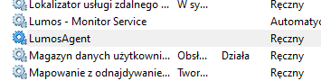
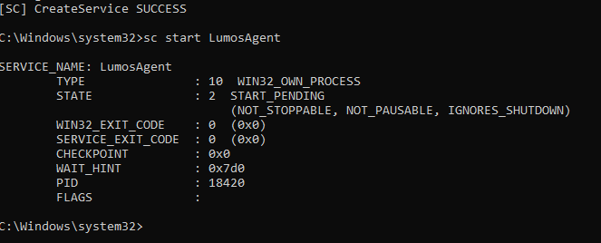
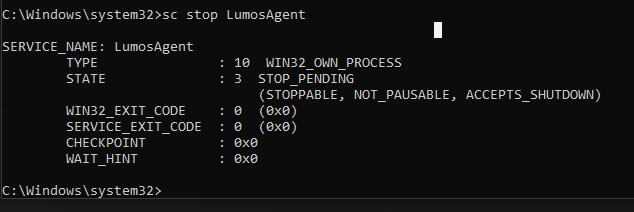
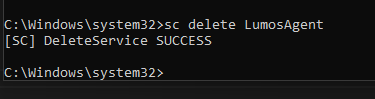
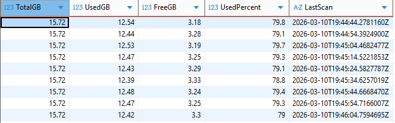

# Lumos


**Lumos** to usługa systemu Windows odpowiedzialna za monitorowanie stanu komputera oraz zbieranie danych diagnostycznych o systemie.
Usługa cyklicznie gromadzi informacje o wydajności i konfiguracji komputera, które mogą być wykorzystywane do diagnostyki, monitorowania lub integracji z innymi komponentami systemu Lumos.

Projekt został zaprojektowany w sposób modułowy i składa się z **agenta monitorującego** oraz **biblioteki współdzielonej**.

---

# Przegląd

Lumos w sposób ciągły zbiera informacje o stanie komputera, takie jak metryki wydajności czy dane sprzętowe.
Zebrane informacje mogą pomóc w identyfikacji problemów, analizie wydajności oraz wspierać proces diagnostyki stacji roboczych.

Przykładowe zastosowania:

* monitorowanie wydajności stacji roboczych
* wsparcie diagnostyki IT
* analiza kondycji systemu
* integracja z systemami wsparcia technicznego

---

# Agent (usługa Windows)

**Agent** to usługa systemu Windows odpowiedzialna za zbieranie danych o komputerze.

Usługa działa w tle i w określonych odstępach czasu gromadzi informacje o systemie, takie jak:

* użycie CPU
* użycie pamięci RAM
* wykorzystanie dysku
* uruchomione procesy
* informacje o systemie

Zebrane dane mogą być:

* zapisywane lokalnie w pliku bazy danych SQLite
* wysyłane do zewnętrznych usług
* wykorzystywane przez inne komponenty systemu Lumos do diagnostyki.

### Odpowiedzialności

* zbieranie metryk systemowych
* monitorowanie stanu komputera
* udostępnianie danych diagnostycznych
* integracja z innymi usługami

---

# Technologie

Projekt wykorzystuje następujące technologie:

* **.NET**
* **Windows Service**
* **WMI / systemowe API Windows**
* **architektura modułowa**

---

# Przykładowe zbierane dane

Agent może zbierać między innymi:

* obciążenie procesora
* dostępna pamięć RAM
* wykorzystanie dysków
* lista uruchomionych procesów
* informacje o sprzęcie
* dane o systemie operacyjnym

---

# Struktura projektu

```
Lumos:
   - Lumos.Agent
   Usługa Windows odpowiedzialna za zbieranie danych o systemie

```

---

# Instalacja

1. Sklonuj repozytorium:

```
git clone https://github.com/studiocyfrowe/Lumos.git
```

2. Przejdź do katalogu projektu:

```
cd lumos
```

3. Zbuduj projekt:

```
dotnet build
```

4. Opublikuj aplikację (opcjonalnie):

```
dotnet publish -c Release
```

---

# Instalacja usługi Windows

Po zbudowaniu projektu należy zainstalować usługę w systemie Windows.

### Instalacja

Uruchom terminal jako administrator i wykonaj:

```
sc create LumosAgent binPath= "C:\path\to\Lumos.Agent.exe"
```



### Uruchomienie usługi

```
sc start LumosAgent
```



### Zatrzymanie usługi

```
sc stop LumosAgent
```



### Usunięcie usługi

```
sc delete LumosAgent
```



---

# Odczyt danych SQLite (DBeaver) - przykład zapytania

W programie DBeaver załadować plik bazy danych LumosDatabase.db. 
Przykład zapytania

```sql

SELECT TotalGB, UsedGB, FreeGB, UsedPercent, LastScan
FROM MemoryRamScans

```



# Możliwe kierunki rozwoju

Planowane rozszerzenia projektu:

* zdalne monitorowanie komputerów
* przechowywanie historii wydajności
* system alertów
* integracja z systemami helpdesk
* rozszerzona diagnostyka systemu

---

# Zrzuty ekranu

```txt

[INFO] 2026-03-21T16:03:24.6400224Z [STATUS] Lumos started
[INFO] 2026-03-21T16:03:34.6585814Z [STATUS] Starting device scan
[INFO] 2026-03-21T16:03:34.7388994Z [STATUS] Device data: <PC_NAME> has been collected
[INFO] 2026-03-21T16:03:35.0210046Z [STATUS] Memory RAM data has been updated
[INFO] 2026-03-21T16:03:37.0557829Z [STATUS] Processor CPU data has been updated
[INFO] 2026-03-21T16:03:37.0690217Z [STATUS] Station data has been updated
[INFO] 2026-03-21T16:03:37.0753648Z [STATUS] Scanning the device has been finished
[INFO] 2026-03-21T16:03:47.0877427Z [STATUS] Starting device scan
[INFO] 2026-03-21T16:03:47.1132063Z [STATUS] Device data: <PC_NAME> has been collected
[INFO] 2026-03-21T16:03:47.1906572Z [STATUS] Memory RAM data has been updated
[INFO] 2026-03-21T16:03:48.3786838Z [STATUS] Processor CPU data has been updated
[INFO] 2026-03-21T16:03:48.4033932Z [STATUS] Station data has been updated
[INFO] 2026-03-21T16:03:48.4043893Z [STATUS] Scanning the device has been finished
[INFO] 2026-03-21T16:03:58.4078696Z [STATUS] Starting device scan
[INFO] 2026-03-21T16:03:58.4591862Z [STATUS] Device data: <PC_NAME> has been collected
[INFO] 2026-03-21T16:03:58.5384428Z [STATUS] Memory RAM data has been updated
[INFO] 2026-03-21T16:03:59.7379011Z [STATUS] Processor CPU data has been updated
[INFO] 2026-03-21T16:03:59.7529367Z [STATUS] Station data has been updated
[INFO] 2026-03-21T16:03:59.7539352Z [STATUS] Scanning the device has been finished

```

---

# Licencja

MIT License
