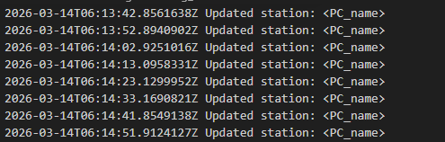

# Lumos

**Lumos** to usługa systemu Windows odpowiedzialna za monitorowanie stanu komputera oraz zbieranie danych diagnostycznych o systemie.
Usługa cyklicznie gromadzi informacje o wydajności i konfiguracji komputera, które mogą być wykorzystywane do diagnostyki, monitorowania lub integracji z innymi komponentami systemu Lumos.

Projekt został zaprojektowany w sposób modułowy i składa się z **agenta monitorującego** oraz **biblioteki współdzielonej**.

---

# Przegląd

Lumos w sposób ciągły zbiera informacje o stanie komputera, takie jak metryki wydajności czy dane sprzętowe.
Zebrane informacje mogą pomóc w identyfikacji problemów, analizie wydajności oraz wspierać proces diagnostyki stacji roboczych.

Przykładowe zastosowania:

* monitorowanie wydajności stacji roboczych
* wsparcie diagnostyki IT
* analiza kondycji systemu
* integracja z systemami wsparcia technicznego

---

# Architektura

Projekt składa się z dwóch głównych komponentów.

## 1. Agent (usługa Windows)

**Agent** to usługa systemu Windows odpowiedzialna za zbieranie danych o komputerze.

Usługa działa w tle i w określonych odstępach czasu gromadzi informacje o systemie, takie jak:

* użycie CPU
* użycie pamięci RAM
* wykorzystanie dysku
* uruchomione procesy
* informacje o systemie

Zebrane dane mogą być:

* zapisywane lokalnie
* wysyłane do zewnętrznych usług
* wykorzystywane przez inne komponenty systemu Lumos do diagnostyki.

### Odpowiedzialności

* zbieranie metryk systemowych
* monitorowanie stanu komputera
* udostępnianie danych diagnostycznych
* integracja z innymi usługami

---

## 2. Lumos.Common (biblioteka współdzielona)

**Lumos.Common** to biblioteka klas zawierająca współdzielone modele danych oraz narzędzia wykorzystywane w różnych komponentach systemu.

Biblioteka umożliwia ponowne użycie tych samych struktur danych i logiki w wielu częściach projektu.

### Zawartość biblioteki

* modele danych systemowych
* obiekty DTO
* narzędzia pomocnicze
* wspólne abstrakcje

### Zalety

* redukcja duplikacji kodu
* spójne struktury danych w całym systemie
* łatwiejsza integracja między komponentami

---

# Technologie

Projekt wykorzystuje następujące technologie:

* **.NET**
* **Windows Service**
* **WMI / systemowe API Windows**
* **architektura modułowa**

---

# Przykładowe zbierane dane

Agent może zbierać między innymi:

* obciążenie procesora
* dostępna pamięć RAM
* wykorzystanie dysków
* lista uruchomionych procesów
* informacje o sprzęcie
* dane o systemie operacyjnym

---

# Struktura projektu

```
Lumos
│
├─ Lumos.Agent
│  Usługa Windows odpowiedzialna za zbieranie danych o systemie
│
└─ Lumos.Common
   Wspólna biblioteka modeli i narzędzi
```

---

# Instalacja

1. Sklonuj repozytorium:

```
git clone https://github.com/studiocyfrowe/Lumos.git
```

2. Przejdź do katalogu projektu:

```
cd lumos
```

3. Zbuduj projekt:

```
dotnet build
```

4. Opublikuj aplikację (opcjonalnie):

```
dotnet publish -c Release
```

---

# Instalacja usługi Windows

Po zbudowaniu projektu należy zainstalować usługę w systemie Windows.

### Instalacja

Uruchom terminal jako administrator i wykonaj:

```
sc create LumosAgent binPath= "C:\path\to\Lumos.Agent.exe"
```

### Uruchomienie usługi

```
sc start LumosAgent
```

### Zatrzymanie usługi

```
sc stop LumosAgent
```

### Usunięcie usługi

```
sc delete LumosAgent
```

---

# Możliwe kierunki rozwoju

Planowane rozszerzenia projektu:

* zdalne monitorowanie komputerów
* przechowywanie historii wydajności
* system alertów
* integracja z systemami helpdesk
* rozszerzona diagnostyka systemu

---

# Zrzuty ekranu



---

# Licencja

MIT License
